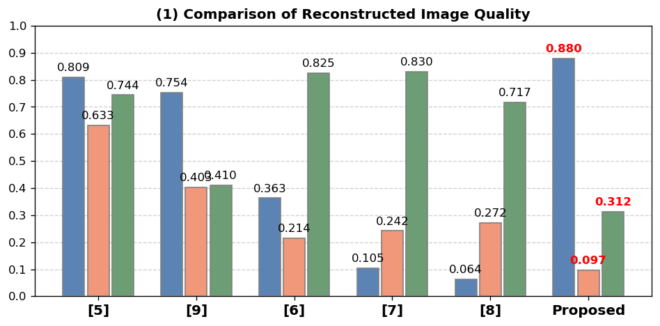
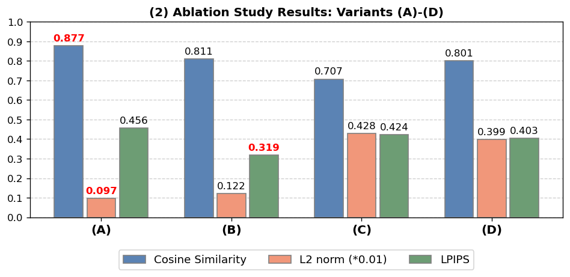
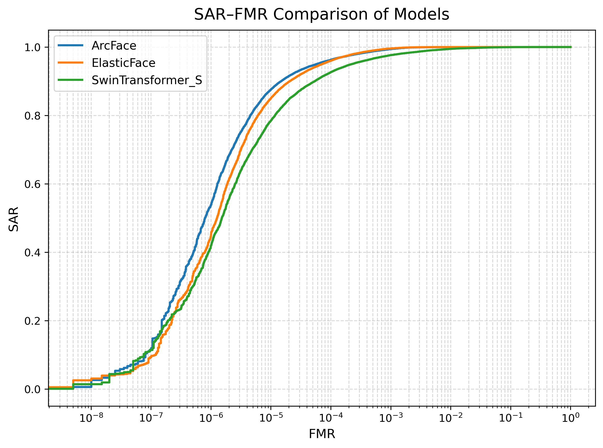

# 08 Python Data Visualization

## Overview
This section demonstrates the ability to use Python for research-oriented data visualization in a face recognition and template inversion study. The visualizations were created to compare reconstruction quality across methods and to analyze SAR–FMR behavior across different backbone models.

## Note
The data that is used to analyze this graph is too big for github so i did not upload it here

## Visualization 1: Reconstructed Image Quality Comparison
The first visualization is a bar-chart-based comparison of reconstructed image quality across multiple methods. It includes two parts:

1. **Comparison of Reconstructed Image Quality**  
   This figure compares multiple methods using three evaluation metrics:
   - Cosine Similarity
   - L2 norm
   - LPIPS
   

2. **Ablation Study Results**  
   This figure compares several internal variants of the proposed method, labeled as (A)–(D), using the same evaluation metrics.
   

### Purpose
This visualization helps compare reconstruction quality across baseline methods and proposed variants in a clear and interpretable way.

## Visualization 2: SAR–FMR Comparison Across Backbone Models
The second visualization is a SAR–FMR curve comparing three face recognition backbone models:

- ArcFace
- ElasticFace
- SwinTransformer_S

The plot was generated in Python using score arrays stored in NumPy format and ROC-based computation.

### Purpose
This visualization shows how the attack success rate (SAR) changes with respect to the false match rate (FMR) for different backbone models under template inversion attack evaluation.

### Files
- `gen_graph.ipynb`
- `sar_fmr_comparison.ipynb`

### Input Data
The SAR–FMR visualization uses score files stored in the following directories:
- `ArcFace/all_sections/`
- `ElasticFace/all_sections/`
- `SwinTransformer_S/all_sections/`

The main input files include:
- `combined_sar.npy`
- `combined_impostor.npy`